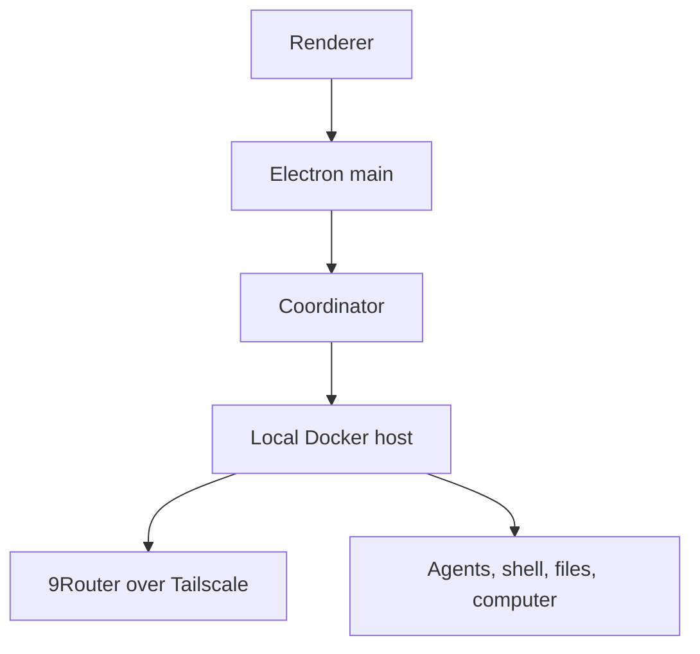

# Grok Bot 0.18 —— 重建与扩展版


本仓库是对公开发布的 Grok Bot 0.18.0 桌面应用的非官方、面向源码的重建。经过审校的构建路径支持 macOS arm64，以及一个未签名、仅本机的 Windows x64 便携目录。

这个项目最初的目的是弄清该桌面应用是如何被组装起来的。现在它包含了 Electron、host、协调器、本地执行、协议、渲染层等边界对应的可读 TypeScript 实现，外加一套确定性工具链，可把这些源码重新编译回一个可运行的 macOS 应用。

Windows 便携版还带有一个**无需登录的 Local 9Router 工作区**。在该模式下，9Router 负责模型推理，而一个自有本地 Docker 虚拟机负责 Grok Bot 的 agent、shell、文件与电脑能力。它不会创建或模拟任何 Cursor 账号会话。

它还加入了一些实用性实验：

- 面向 Cursor、Claude Code、Codex、OpenRouter，以及 9Router 等本地 OpenAI 兼容 API 的推理路由器；
- 跨这些路由提供方的 Grok Bot 插件/MCP 工具；
- 路由推理的本地用量统计；
- 用可选的本地 Docker 沙箱替代远端箱子，其中就包含一个无需 Cursor 登录的 Windows Local 9Router 工作区；以及
- 一个整合进精致官方 UI 的重建设置界面。

这是一个研究与破解性质的项目，既不是 Anysphere 的原始 monorepo，也不是官方 Grok Bot 发行版。它保持对固定版本 0.18.0 应用的重建；Local 9Router 工作区并不使它成为最新官方 Grok Bot。那些从编译产物中推断出的名称和模块边界，可能与原始源码存在差异。

## 仓库里有什么？

已提交到仓库的目录树包含经审校的重建源码、测试、清单、构建脚本，以及 macOS arm64 与 Windows x64 原始安装程序的 Git LFS 留存副本。它刻意**不**提交提取出的上游应用、构建产物、本地凭据，或庞大的取证恢复工作区。

公开的 Grok Bot 0.18.0 应用反而被当作一个固定的构建输入。在 bootstrap 阶段，工具链会下载它、校验其 SHA-256 身份，并提取出组装重建所必需的部分。

产物 macOS 应用在设计上是混合体：

- 应用运行时由 `source/` 下的可读源码编译；
- 精修的官方渲染器仍作为 UI 基线；
- 一个窄而确定性的转换加入了重建的 Router 设置 UI；
- 原始与打过补丁的渲染器 chunk 哈希会被记录并校验；且
- 最终应用使用独立的 bundle 标识符和临时签名。

机器上已安装的上游应用永远不会被覆盖。

### 为何保留官方渲染器？

发布的应用并不包含原始前端源码或 source map。它只包含优化压缩过的生产 JavaScript 与 CSS chunk：足以考察行为、恢复契约，却不足以得到原创的 React 组件、名称、注释、文件结构或设计系统源码。

要完全复刻同样精致度和行为的完整前端，就会是一个更大、另外独立的逆向工程项目，对于一个周末构建来说并不现实。因此，制作精致的 macOS 包时务实的做法是：重建运行时与控制面代码，保留按哈希锁定的官方渲染器，并做一处为新的 Router 设置所需的最小、可审计的 UI 补丁。Windows 便携路径则改而打包经审校的干净源码渲染器，使 OpenAI 兼容 / 9Router 设置在正常构建图中生效，而不是走平台特定的压缩补丁。

`frontend/` 是一份可读的部分重建与设计工作区。它有助于理解 UI 契约、实验干净的组件，但不应被误认为是 Anysphere 缺失的原始前端源码，也不应被当作官方渲染器的像素级替代品。

## 保留的原始安装程序

精确的 0.18.0 安装程序的研究副本位于 `research-archives/original/0.18.0/`。macOS arm64 DMG 使用 Git LFS 存储；Windows x64 Setup.exe **不**被 git 跟踪，而是作为一个 GitHub Release 资产分发（见下），因此克隆体积保持很小，Windows 构建路径无需 LFS pull：

| 平台 | 文件 | SHA-256 |
| --- | --- | --- |
| macOS arm64 | `macos-arm64/Grok_Bot_0.18.0.dmg` | `a253ccd8aab01e083f9812a0264354c5034d8ba7f0610bbb557e82ae77d203eb` |
| Windows x64 | `windows-x64/Grok_Bot_0.18.0_Setup.exe` | `464079a15ef5fa8b61ccea8fffcc78f63cfcf6df65fb0ad5e725d8b95f7e437e` |

源码 URL、体积、校验命令以及机器可读的产物清单，参见 [research-archives/README.md](research-archives/README.md)。

### 获取 Windows Setup.exe（通过 Release 资产分发）

一次性下载它（校验和见下），并放置到
`research-archives/original/0.18.0/windows-x64/Grok_Bot_0.18.0_Setup.exe`：

```
https://github.com/GeniusTDY/grok-bot-offline/releases/download/v0.18.0-offline/Grok_Bot_0.18.0_Setup.exe
```

```sh
# 使用前先校验
sha256sum Grok_Bot_0.18.0_Setup.exe
# 464079a15ef5fa8b61ccea8fffcc78f63cfcf6df65fb0ad5e725d8b95f7e437e
```

> 因为 Setup.exe 是 Release 资产（不在 git 中跟踪），**不要**指望通过
> `git lfs pull` 拉取它。在离线机上，请先在联网机器上下载一次，再带到上面指定的路径。

## 当前特性

### 推理路由器

打开 **Settings → Router** 选择新回合所用的后端：

| 提供方 | 认证方式 | 工具支持 |
| --- | --- | --- |
| Cursor | 现有的 Grok Bot/Cursor 会话 | 原生 Grok Bot 工具与插件 |
| Claude Code | 现有的 Claude Code 登录 | 路由的 Grok Bot MCP 工具 |
| Codex | 现有的本地 ChatGPT/Codex 登录 | 使用 Grok Bot 工具的 Direct Responses 传输 |
| OpenRouter | 通过桌面 secrets 桥保存的 API key | Grok Bot 工具执行循环 |
| OpenAI 兼容 / 9Router | 专用、系统加密的 proxy/client API key | 本地 Docker 工作区中的原生 agent、shell、文件与电脑能力；仅账号的云端功能保持不可用 |

Cursor 是默认项。当 Claude Code 与 Codex 的本地客户端已认证时，它们不需要额外的 API key。应用会在被路由的对话中保留流式响应、思考状态、reaction、富插件提及，以及 MCP 工具执行。

#### 9Router / OpenAI 兼容设置

请使用**当前稳定版 9Router**（审校该路径时是 v0.5.35）。在全新 Windows 便携 profile 上，在登录界面选择 **Configure 9Router**；否则打开 **Settings → Router**。选择 **OpenAI-compatible / 9Router**（内部提供方 ID 是 `cli-proxy`）。保存 9Router 的 **proxy/client API key**（不要用其管理 key）。若不确定精确的模型 ID，可先只保存 URL 与 key、把模型留空，选择 **Test & load models**，选一个模型，再次保存。手动输入模型仍然可用，因为 9Router 的 `/v1/models` 返回结果可能省略免费或无认证的模型。

Chat Completions 是默认协议，因为它当前对 9Router 的兼容性最广。Auto 也会优先使用 Chat Completions。显式的 Responses 对非原生路由仍可用，但本地 Docker 原生 agent 路径会拒绝它，因为其 tool-call 重放尚未被验证。请只使用经过认证的 `/v1` 端点；`/codex` 重写会被有意拒绝。在 loopback 之外，明文 HTTP 默认被拒绝。单独的 **Allow HTTP over Tailscale** 开关仅允许字面上的 Tailscale IP 地址；它不允许多个任意的私有或公网 HTTP 主机。MagicDNS 名称会被有意拒绝用于 HTTP。远程 DNS 名称需要 HTTPS 与单独的 HTTPS 开关。数字区间校验并无法证明当前激活的是哪个 Windows 路由，因此在启用明文 HTTP 之前，请先确认 `tailscale ping 100.112.10.8` 成功。本地 Docker 工作区不共享 Windows loopback：其 host 容器内的 `127.0.0.1` 指的是该容器自身，而不是同一台 PC 上的 Windows 9Router 进程。

9Router key 存储在一个独立用途的 Electron `safeStorage` 文件中。它永远不会被放入用户 secrets、box-secret 同步、环境变量、设置、渲染器状态响应或 transcript 中。如果操作系统安全存储不可用，它仅仅保存在当前会话的内存里。在将本地 Docker 工作区宣布为就绪之前，经认证的本地 gateway 会装入该内存租约，并在 Docker host 内调用一个不带凭据参数 `/v1/models` 探针。
在一次本地原生回合开始前，经认证的本地 gateway 会给 Docker host 一个短时、仅存内存的凭据租约。host 无法通过该 gateway 读回之前的租约，也不会持久化它。改变端点来源（scheme、host 或 port）不会复用之前的 key；用户必须重新输入 key。

免登录工作区会暴露本地 agent 运行时及其 shell、文件与电脑工具。它不会伪造 Cursor 登录，因此在出现真实账号会话之前，共享房间、远端箱子、账号背书的插件、计费以及其他云端/仅账号功能仍不可用。

**Usage & Billing** 会显示对返回用量数据的提供方进行本地记录的请求与 token 统计。这些数字是活动记录，并非权威的提供方账单。

### 本地 Docker 沙箱

Router 页还有一个 **Use local Docker VM** 开关。启用后，Grok Bot 会在一个自有本地容器中运行其 box host 与执行守护进程，而不再连接远端沙箱。

该容器：

- 通过不可变的 manifest digest 锁定经审校的 linux/amd64 沙箱镜像；
- 只把 gateway/VNC 端口 `1340`、`6080`、`6081` 发布到 Windows loopback；执行/控制端口 `1337`、`1339`、`8790` 不会发布到 host；
- 以只读方式挂载经审校的 host bundle 与 stock-daemon 启动器，当它们的 content hash 变化时替换自有容器；
- 在独立 9Router 模式下，以非 root 的 `box` 用户、不带有效 capabilities 且带有 `no_new_privs` 的方式运行带 Computer 能力的 stock 模型侧守护进程；它直接分叉出的窗口进程继承该身份，且这条免登录模型路径没有 root shell；
- 只给 root host 进程一个只读、root 拥有的 gateway-token 卷，模型侧守护进程无法读取；
- 在免登录工作区使用短时内存 9Router 凭据租约，或按需复用用户已有的提供方认证；
- 在独立 9Router 模式下省略 host Codex/Claude 凭据挂载、host 控制环境值，以及裸包抓取；
- 在协调器连接前完成校验；且
- 通过同一套设置生命周期被停止或替换。

必须运行 Docker Desktop 或其他兼容的本地 Docker 守护进程。对仅账号操作而言，远端模式仍是默认。免登录的 Windows Local 9Router 工作区要求启用 **Use local Docker VM**。这些控制无法抵御 Windows 或 Docker 管理员；容器内的 agent 有意保留对其自身工作区与浏览器的控制。启动时会一次性 live-attest 主模型守护进程；之后的窗口分叉依赖继承的限制，不会被逐个 live-attest。

## 环境要求

所有构建都需要 Node.js 26.5.x 与 Git LFS。macOS 打包需要 Apple Silicon 与 Xcode Command Line Tools。Windows 打包需要 Windows 10/11 x64；精确的 7-Zip 解压器由锁定的 `7zip-bin` 依赖提供。Docker Desktop 对其它路由是可选的，但对完整的免登录 Local 9Router 工作区是必需的。

对于离线（完全断网）的 Windows 构建，请见下方“离线构建”一节；它让你无需安装 Node 或联网即可完成构建。

## 离线 / 完全断网的 Windows 构建

### 端到端一键部署（速览）

整个离线 Windows 部署只有三步。只有 Setup.exe 下载与第 2 步需要联网机器；离线目标机器从不接触网络：

1. **准备 Setup.exe**（一次，任一台联网机器）。将 Release 资产下载并放置/复制到
   `research-archives/original/0.18.0/windows-x64/Grok_Bot_0.18.0_Setup.exe`（见上方“获取 Windows Setup.exe”）。
2. **生成离线快照**（一次，联网 Windows x64 机器）：`online-fetch.cmd`。这是唯一会访问 npm registry 的步骤；它会写出 `offline/cache/node_modules-snapshot.tar.gz` 与 `offline/cache/tree-sitter-node-cache.tar.gz`。（在没有 Node 的机器上，先运行 `scripts/offline/bootstrap-windows.ps1` 来准备 vendored Node。）
3. **把整个仓库**（含 `offline/` 与 `research-archives/`）**复制到离线机器**，然后运行 `offline-build.cmd`。产物位于 `dist/Grok Bot 0.18 Reconstructed-win32-x64/`，完全离线且自包含。

如果 `offline/cache/*.tar.gz` 快照已随仓库一起分发，那么第 2 步可以跳过，离线机器只需执行第 3 步。

---

你可以在**没有安装 Node.js 且没有网络**的离线 Windows 10/11 x64 机器上打包。恰好**一步**需要网络；其它一切都已内置到项目中，可完全离线运行。

每个构建脚本都会通过 `process.execPath`（见 `scripts/lib/clean-build.mjs`、`scripts/lib/asar-integrity.mjs` 以及 node-gyp 入口）运行其子进程，因此用 vendored Node 启动构建会让所有子进程都运行在同一份 vendored Node 上。`offline.cmd` 还会把 vendor 目录前置到 `PATH`，使内嵌的 `npm run ...` / `npx` 调用解析到内置副本，而不是系统 npm。

项目已内置以下离线前置依赖：
- **vendored 版 Windows Node** → `offline/vendor/node/win32-x64/`（node.exe + npm）

**官方 Setup.exe** 只在你把 Release 资产下载放置到
`research-archives/original/0.18.0/windows-x64/` 时才按手动方式内置（见上方“获取 Windows Setup.exe”）；它不在 git 中跟踪。

唯一未内置的东西（因为它平台相关）是 Windows 的 `node_modules` 快照，它在下面唯一的一次联网步骤中生成。

### 1. 唯一联网步骤：生成 Windows node_modules 快照

在**联网 Windows x64 机器上运行一次**。它使用已内置的 vendored Node（无需系统 Node 或 npm）；它接触的唯一网络是 npm 包 registry：

```bat
online-fetch.cmd
```

该脚本会运行 `npm ci` → `npm run postinstall`，把打过补丁的 `node_modules` 快照到 `offline/cache/node_modules-snapshot.tar.gz`，然后预编译原生 `tree-sitter` 绑定并把该缓存快照到 `offline/cache/tree-sitter-node-cache.tar.gz` —— 全部基于 vendored Node。

> 预编译的 tree-sitter 缓存，决定离线机器是“开箱即用”，还是仍需要一套 MSVC/Windows SDK 工具链。
> `package:windows` 在首次运行时会通过 `node-gyp` 编译这些绑定
> （`scripts/lib/clean-build.mjs` → `stageNodeTreeSitterRuntime`），但当
> `.cache/tree-sitter-node/{abi}/{platform}-{arch}` 已包含绑定时会完全短路。
> `online-fetch.cmd` 的第 4 步恰好生成该缓存；`offline.cmd restore` 会把它放回原位，
> 从而使离线机器永远不用编译，也不需要 C++ 工具链。

> 如果快照已提交到仓库中（也就是你把 `offline/cache/*.tar.gz` 作为项目的一部分分发），你可以在离线目标上完全跳过这一步。

如果你更想在具备 Node 的机器上手动生成快照：

```sh
npm ci
npm run postinstall
node scripts/offline/fetch-vendor.mjs modules
node scripts/build-tree-sitter-node.mjs        # 仅当存在 MSVC 工具链时
node scripts/offline/fetch-vendor.mjs nodedeps # 快照预编译缓存
```

### 2. 离线目标：一次性构建

在没有**任何 Node 与任何网络**的干净离线机器上，整个 Windows 构建是单步操作：

```bat
offline-build.cmd
```

它会先从快照恢复 `node_modules`，然后完全在 vendored Node 上运行
`bootstrap:windows`、`package:windows`、`verify:windows`，并使用保留的官方 `Setup.exe`。产物落在 `dist/Grok Bot 0.18 Reconstructed-win32-x64/`。

如需更精细的控制，底层命令仍然可用：

```bat
offline.cmd restore          :: 从快照恢复 node_modules
offline.cmd run typecheck
offline.cmd run source:typecheck
offline.cmd run test:windows
offline.cmd run package:windows
offline.cmd run verify:windows
offline.cmd run smoke:windows
```

生成的 `dist/Grok Bot 0.18 Reconstructed-win32-x64/` 是自包含的（除 Docker 与你的本地 OpenAI 兼容端点为，没有其它运行时依赖），因此可完全离线运行。

> Docker 沙箱镜像通过不可变 manifest digest 固定，并在首次使用时拉取；在离线目标上，请先在联网机器上 `docker save` 成 tar，再单独 `docker load` 导入一次。

## macOS 快速开始

```sh
git clone <your-repository-url>
cd grok-bot-0.18-reconstructed
git lfs install
git lfs pull
npm ci
npm run bootstrap
npm run check
npm run package
open "dist/Grok Bot 0.18 Reconstructed.app"
```

`npm run bootstrap` 首先使用固定版本 0.18.0 DMG 的 Git LFS 留存副本。若该归档缺失，则回退到原始公开 URL；`GROK_BOT_018_APP` 也可以指向一份已有的应用副本。Bootstrap 会校验 DMG 与 `app.asar`、缓存匹配的 Electron 运行时，并填充被忽略的 `src/app/dist` 构建输入。

`npm run package` 编译重建的运行时、应用窄渲染器/设置转换、创建应用 bundle、赋予重建的 bundle 标识、做临时签名，并校验结果。输出写入：

```text
dist/Grok Bot 0.18 Reconstructed.app
```

重建的包在打包边界禁用上游更新器，并默认关闭上游 Sentry 与遥测上报。显式提供的环境配置仍会被尊重。

## Windows x64 本地便携构建

Windows 路径有意产出目录而非安装程序。它校验保留的 Setup 可执行文件的校验和、用固定的 `7zip-bin@5.2.0` 二进制解压它（不执行 NSIS）、把上游 `app.asar`、Electron carrier、签名器以及每个解包的原生模块都作为 PE x86-64 校验，然后用干净源码重建的应用负载替换它。

在 PowerShell 或 Developer Command Prompt 中运行以下命令：

```powershell
git lfs install
git lfs pull --include="research-archives/original/0.18.0/windows-x64/Grok_Bot_0.18.0_Setup.exe" --exclude=""
npm ci
npm run bootstrap:windows
npm run typecheck
npm run source:typecheck
npm run test:windows
npm run package:windows
npm run verify:windows
npm run smoke:windows
```

产物为：

```text
dist/Grok Bot 0.18 Reconstructed-win32-x64/
  Grok Bot 0.18 Reconstructed.exe
```

`package:win` 与 `package-windows` 是 `package:windows` 的别名。
在 Windows 上，`smoke:windows` 会用新的临时 profile 和严格的假 Docker/控制面 harness 启动打包好的可执行文件。它会保存一个系统加密的 9Router 凭据、认证 `/v1/models`、强制执行模型与 Docker 拦阻逻辑、在进入未登录工作区前等待带认证的协调器 resync、以租约撤销干净退出，并在重启后重复该流程。常规仓库 check 会在 `windows-latest` 上执行同样的有界启动并丢弃该二进制。

仓库维护者可以在新 fork 上显式启用 Actions 后运行 **Windows 推入可见的 draft release**。该工作流会重复源码、打包与全新 profile 的启动检查，创建 ZIP、将其重新解压到一个干净的临时目录、重复校验与启动 smoke、生成校验和与一份按产物归因的生产依赖 SBOM，并把精确文件附加到一个未发布的 Draft Release。它**从不**自动发布公开 release。该 draft 仍需接受下文所述的权利与签名审查。GitHub 只对有推入权限的用户暴露未发布的 draft；它在本质上并非不可变。该工作流强制实行追加式、精确恢复策略：一个完全同提交的 draft 重跑可以逐字节核对已有资产并只补充缺失项，但它绝不会替换资产或复用不匹配的 tag。任何
新二进制都要求提升包的版本号，而对 `main` 上打包应用或校验输入的任何改动都会触发一次新的 draft 尝试。校验过的文件由 Windows job 直接上传，绝不经过一般的 Actions 产物握手。当推入可见 draft 中已有的任何字节与新校验的 bundle 不一致时，重跑会中止。ZIP、CycloneDX SBOM、manifest 与校验和会被构建两次，且必须逐字节相同。ZIP 时间戳与 manifest 来源时间源自确切的 Git 提交。SBOM 省略逐代序列号与时间戳字段，而不是歪曲源码身份。它记录便携 ZIP 的 SHA-256、生产 npm 依赖与打包的 Electron 框架，但不会记录每一个原生或恢复出的上游字节。
在追加任何缺失资产之前，都会对现有每个 draft 资产做预检；任何非空的既有资产都不会被删除或覆盖。GitHub 的空零字节上传占位，只有在完整预检通过后才能退役。

### Windows 免登录 Local 9Router 工作区

这是在不使用 Cursor 登录的前提下使用重建 Windows 应用、同时保留本地 agent 与电脑工具的经审校路径。开始前，请确保以下全部成立：

- Windows 10/11 x64 正在运行重建的便携应用；
- Docker Desktop 已安装、正在运行，且能启动 Linux 容器；
- 这台 Windows PC 可以通过 Tailscale 以字面地址 `100.112.10.8` 访问 9Router 服务器；
- 该服务器运行当前稳定版 9Router（审校时为 v0.5.35），并在端口 `20128` 上暴露其已认证的 `/v1` API；
- 已签发一个 9Router proxy/client API key；且
- 至少已知一个精确模型 ID，或 `/v1/models` 能返回该模型。

按如下方式配置工作区：

1. 启动 Docker Desktop，确认 Tailscale 已连接，并从 Windows 运行 `tailscale ping 100.112.10.8`。若该检查无法到达目标 tailnet 对端，就不要启用明文 HTTP。
2. 在新 profile 上，于登录界面选择 **Configure 9Router**。在已有 profile 上，打开 **Settings → Router**。
3. 在 **Route agent requests through** 下，选择 **OpenAI-compatible / 9Router**（`cli-proxy`）。
4. 把 **Base URL** 设为 `http://100.112.10.8:20128/v1`，并启用 **Allow HTTP over Tailscale**。请精确使用数字 IP；HTTP MagicDNS 主机名会被拒绝。
5. 输入签发的 proxy/client API key，并为原生 agent 与电脑工具循环保留 **Chat Completions**（或使用 **Auto**）。不要为 Local Docker 工作区选择显式 **Responses**。
6. 若已知精确模型 ID，输入它并选择 **Save 9Router**。若不确定，把模型留空、先保存 URL 与 key、选择 **Test & load models**、选一个返回的模型，再选择 **Save 9Router**。当 models 响应省略该模型时，手动模型值仍然有效。
7. 启用 **Use local Docker VM**。当提供方为 `cli-proxy`、已配置凭据与精确模型 ID、已选择 Chat Completions 或 Auto，且已选择本地 Docker 运行时，工作区才会变为可用。在宣布就绪之前，带认证的 Docker host 会亲自调用 `/v1/models`，因此仅在 Windows 上可达的 URL 会被拒绝。若 Docker 重启过或现有容器需要升级，请选择 **Repair Local Docker VM**。
8. 选择 **Save & continue without sign-in**。设置对话框会一直打开，直到新协调器连接完成其带认证的 resync；任何未满足的要求都会显示在就绪清单中。

该本地工作区无需 Cursor 登录。9Router 执行模型推理；Docker host 执行 agent 编排、shell 命令、文件操作与电脑/浏览器动作。Cursor 背书的远端箱子、共享房间、账号计费以及其他云端/仅账号功能，不会仅仅因为该工作区就绪而变得可用。

自动化的 Windows smoke 使用模拟的 Docker 命令与一个带认证的 loopback gateway，使 CI 无需特权 Docker Desktop 即可验证打包、状态迁移、加密、resync、重启与干净关闭。源码集成测试则分别演练真实的 9Router SSE tool-call 契约、生产 deferred-tool transcript、一次浏览器截图、其结构化图像后续追问，以及最终的模型响应。在目标 PC 上，仍需对该 PC 的 Docker Desktop、Tailnet 路由、实时 9Router 模型、VNC/浏览器栈，以及原生 Linux 容器进程做最终检查。

一个只绑定到 Windows `127.0.0.1` 的同机 9Router 不被 Local Docker 工作区支持，因为容器 loopback 并非 Windows loopback。请使用 9Router 服务器在端口 `20128` 上的字面 Tailscale IP 并启用 **Allow HTTP over Tailscale**，或使用一个从 Linux 容器可达的被允许的 HTTPS 端点。proxy/client API key 是一个凭据；在 Windows 上其存储受真实的 DACL 保护（当前用户、SYSTEM 与 Administrators），而不是 POSIX `0600` 声明。共享凭据 helper 会强制并反复校验该边界。

### Windows 信任与身份边界

便携产物属于非官方、未签名的重建分发。重命名保留的上游 Electron 可执行文件并不会让重建目录变成上游签名产品。这里不提供 NSIS 安装程序、代码签名证书、更新器元数据或自动发行的公开 release；请在重新分发前完成独立的权利与签名审查。

Windows 构建使用独立的 product/package/executable 名称，默认使用 `%APPDATA%\Grok Bot 0.18 Reconstructed`，硬禁用官方更新器、移除更新器可执行文件/配置，且不注册继承的 `sand:` 回调。这个默认值避免占用官方应用的协议关联。因此，全新隔离 profile 不使用 Cursor 的桌面 OAuth 回调；9Router/OpenAI 兼容模式是这个便携构建所支持的、面向免 Cursor 账号首次运行路径。它仍然需要上文描述的那个专用 9Router proxy/client API key。

## 架构



上图展示免登录的 Windows 路径。Electron main 拥有设置与系统加密的 key 存储；协调器会通过带认证的本地 gateway 传递一个短时租约；Docker host 将 9Router 推理与原生本地工具集结合。仅账号的提供方与远端箱子路径保持独立，并继续要求其真实认证。

主要源码区域如下：

- `source/electron-main/` —— 桌面生命周期、设置、认证、box 连接器、协调器所有权与 RPC 处理；
- `source/electron-preload/` —— 暴露给 UI 的窄可信桥接；
- `source/host/` —— 推理、工具、MCP、设置与回合执行；
- `source/node-agent-coordinator/` —— transcript 路由、流式活动、reaction 与路由的 MCP 桥；
- `source/shared/` —— 共享契约、设置、协议与提供方 helper；
- `frontend/` —— 可读的 React/TypeScript 渲染器重建与设计工作区；
- `scripts/` —— 引导、编译、渲染器补丁、打包、签名与校验；以及
- `tests/` —— 发布与路由器回归测试。

更多细节见 [docs/ARCHITECTURE.md](docs/ARCHITECTURE.md)。

## 开发命令

```sh
npm test                  # 聚焦回归测试
npm run typecheck         # 渲染器 TypeScript
npm run source:typecheck  # 运行时 TypeScript
npm run frontend:build    # 构建可读渲染器重建
npm run package           # 构建、签名并校验 macOS 应用
npm run verify            # 校验一个已打包的应用
npm run smoke             # 有界原生 smoke 检查
npm run package:windows   # 本地未签名 Windows x64 便携目录
npm run verify:windows    # 对该目录的结构/哈希/原生校验
npm run smoke:windows     # 打包免登录工作区、重启与干净退出 smoke
npm run docker:image:verify # 校验固定的公开 ECR manifest 与运行时配置
npm run publication:check # 证明一份全新历史的导出是无损的
```

生成目录（包括 `.cache`、`.build`、`dist`、`src/app/dist`、`recovered`、`recovery` 以及本地探针根目录）均被忽略。

## 项目状态

应用可启动，核心重建流程可用，包括路由推理、已连接插件与本地 Docker 沙箱。这仍是实验性重建：它针对固定 0.18.0 macOS/arm64 与 Windows/x64 carrier，依赖外部提供方会话或一个配置好的 OpenAI 兼容端点，并且不承诺与未来 Grok Bot 版本兼容。

变更须知见 [CONTRIBUTING.md](CONTRIBUTING.md)。干净历史导出流程见 [docs/PUBLISHING.md](docs/PUBLISHING.md)。技术溯源与保留的上游边界见 [PROVENANCE.md](PROVENANCE.md) 与 [NOTICE.md](NOTICE.md)。