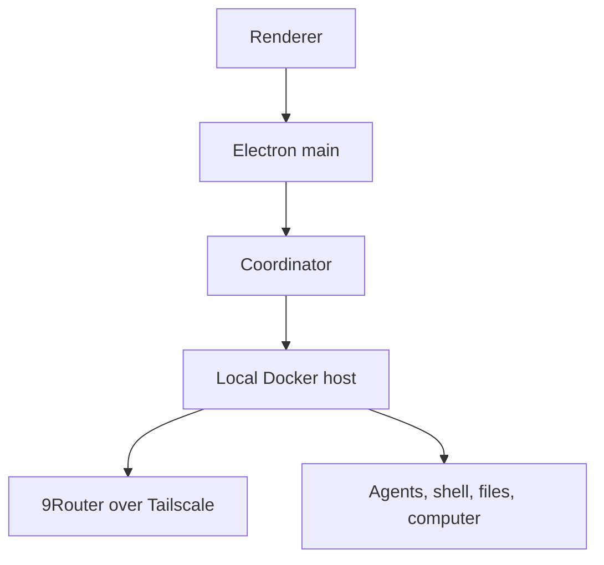

# Grok Bot 0.18 — 重建与扩展版

**非官方源码重建 · Windows x64 便携版 · 免登录本地工作区**

对公开发布的 Grok Bot 0.18.0 桌面应用的非官方、面向源码重建。仅针对未签名的 Windows x64 便携目录。

Windows 便携版提供**免登录 Local 9Router 工作区**：9Router 提供模型推理，本地 Docker 虚拟机提供 agent / shell / 文件 / 电脑能力，不创建或模拟 Cursor 会话。

> 这是研究与破解项目，非 Anysphere 官方代码，也不是官方发行版。仅重建固定 0.18.0 版本。

---

## 目录

1. [主要特性](#主要特性)
2. [环境要求](#环境要求)
3. [保留的原始安装程序](#保留的原始安装程序)
4. [离线 / 完全断网构建](#离线--完全断网构建)
5. [Windows x64 便携构建](#windows-x64-便携构建)
6. [架构](#架构)
7. [项目状态](#项目状态)

---

## 主要特性

**推理路由器** — `Settings → Router`

| 提供方 | 认证 |
| --- | --- |
| Cursor（默认）、Claude Code、Codex | 复用本地登录 |
| OpenRouter | API key |
| OpenAI 兼容 / 9Router（ID `cli-proxy`） | 专用加密 key |

其他：本地 Docker 沙箱（`Use local Docker VM`）、免登录本地工作区、路由推理用量统计、重建设置界面。

### 9Router / OpenAI 兼容设置

1. 登录界面选 **Configure 9Router**（或 `Settings → Router`）。
2. 提供方选 **OpenAI-compatible / 9Router**。
3. 填 Base URL（如 `http://100.112.10.8:20128/v1`）、proxy/client API key、模型 ID，保存。
4. 只走已认证的 `/v1`；loopback 外默认拒绝明文 HTTP，Tailscale IP 需单独开关。
5. 免登录工作区需启用 `Use local Docker VM`，且 Docker Desktop 运行中。

---

## 环境要求

- Node.js 26.5.x + Git LFS
- Windows 打包：Windows 10/11 x64；Docker Desktop（仅本地 Docker 工作区需要）

---

## 保留的原始安装程序

存放于 `research-archives/original/0.18.0/`。

| 文件 | SHA-256 |
| --- | --- |
| `windows-x64/Grok_Bot_0.18.0_Setup.exe` | `464079a15ef5fa8b61ccea8fffcc78f63cfcf6df65fb0ad5e725d8b95f7e437e` |

### 获取 Windows Setup.exe

Setup.exe 是 GitHub Release 资产（不在 git 中，勿用 `git lfs pull`）。一次性下载并放置到：

`research-archives/original/0.18.0/windows-x64/Grok_Bot_0.18.0_Setup.exe`

```txt
https://github.com/GeniusTDY/grok-bot-offline/releases/download/v0.18.0-offline/Grok_Bot_0.18.0_Setup.exe
```

```sh
sha256sum Grok_Bot_0.18.0_Setup.exe
# 464079a15ef5fa8b61ccea8fffcc78f63cfcf6df65fb0ad5e725d8b95f7e437e
```

### vendored Node（已内置，无需下载）

离线构建用到的 Node 运行时已内置本仓库：`offline/vendor/node/win32-x64/`（官方 `node-v26.5.0-win-x64` 全量内容），随项目/拷贝分发，`online-fetch.cmd` 与 `offline-build.cmd` 直接使用，无需任何下载。

如需重建或升级，可在联网机器运行 `scripts/offline/bootstrap-windows.ps1` 重新生成该目录。

---

## 离线 / 完全断网构建

端到端一键部署，共三步，仅下载 Release 附件需要一次联网，之后完全离线：

| 步骤 | 位置 | 操作 |
| --- | --- | --- |
| ① 放置 Setup.exe | 任意联网机器 | 从 Release 下载（上节），放到 `research-archives/original/0.18.0/windows-x64/` |
| ② 放置离线快照 | 任意联网机器 | 从 Release 下载两个快照，放到 `offline/cache/` |
| ③ 一键构建 | 离线机器 | 拷贝仓库后运行 `offline-build.cmd` |

两个快照附件（从 Release 下载）：

```txt
https://github.com/GeniusTDY/grok-bot-offline/releases/download/v0.18.0-offline/node_modules-snapshot.tar.gz
https://github.com/GeniusTDY/grok-bot-offline/releases/download/v0.18.0-offline/tree-sitter-node-cache.tar.gz
```

其中：

- 快照就位后无需运行 `online-fetch.cmd`；`offline-build.cmd` 会自动 `restore` 并构建。
- 也可在联网构建机运行 `online-fetch.cmd` 重新生成快照，产物输出到同一 `offline/cache/`。
- ③ 产物为 `dist/Grok Bot 0.18 Reconstructed-win32-x64/`，完全离线自包含。

---

## Windows x64 便携构建

联网开发机。流程：校验 Setup 校验和 → 用固定 `7zip-bin` 解包（不执行 NSIS）→ 替换为重建负载 → 输出目录。

```powershell
git lfs install
git lfs pull --include="research-archives/original/0.18.0/windows-x64/Grok_Bot_0.18.0_Setup.exe" --exclude=""
npm ci
npm run bootstrap:windows
npm run typecheck
npm run source:typecheck
npm run test:windows
npm run package:windows
npm run verify:windows
npm run smoke:windows
```

产物：`dist/Grok Bot 0.18 Reconstructed-win32-x64/Grok Bot 0.18 Reconstructed.exe`

> 离线部署请走上方 [离线 / 完全断网构建](#离线--完全断网构建)，开发机（联网）才用本节命令。

---

## 架构



主要目录：

| 目录 | 职责 |
| --- | --- |
| `source/electron-main/` | 桌面生命周期 / 设置 / 认证 / 协调器 |
| `source/electron-preload/` | 可信 UI 桥 |
| `source/host/` | 推理 / 工具 / MCP / 回合 |
| `source/shared/` | 共享契约 |
| `frontend/` | 可读渲染器重建 |
| `scripts/` | 引导 / 编译 / 打包 / 签名 / 校验 |
| `tests/` | 回归测试 |

---

## 项目状态

应用可启动，路由推理、插件与本地 Docker 沙箱可用。仍为实验性重建，不承诺与未来版本兼容。

其他文档：[CONTRIBUTING.md](CONTRIBUTING.md) · [docs/PUBLISHING.md](docs/PUBLISHING.md) · [PROVENANCE.md](PROVENANCE.md) · [NOTICE.md](NOTICE.md)